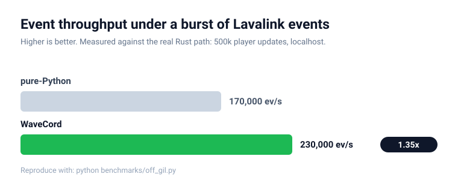
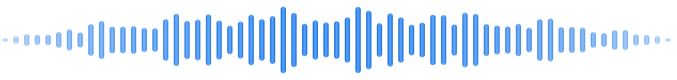

<div align="center">


**A high-performance [Lavalink](https://lavalink.dev) client for Python, powered by a Rust core.**

[](https://pypi.org/project/wavecord/)
[](https://pypi.org/project/wavecord/)
[](https://pypi.org/project/wavecord/)
[](https://www.rust-lang.org/)

[](https://lavalink.dev)
[](https://github.com/Apart-Studio/wavecord/actions/workflows/ci.yml)
[](LICENSE)

</div>

WaveCord speaks **both Lavalink v3 and v4** through a single, version-neutral API,
with the version detected automatically on connect. The performance-critical work
(WebSocket, REST, serialization, reconnect, and node management) runs in native
Rust, off the Python GIL, while a thin async layer on top works with every major
Discord library.

## Features

- **Lavalink v3 and v4** behind one API, auto-detected on connect.
- **Off-GIL networking.** The WebSocket, REST, JSON parsing, and v3/v4
  normalization run on native tokio threads, keeping your event loop responsive
  under load.
- **Typed events.** Handlers receive real objects (`event.track.info.title`),
  decoded straight into [msgspec](https://jcristharif.com/msgspec/) structs.
- **Library-agnostic.** Adapters for discord.py, py-cord, disnake, and nextcord.
- **Batteries included.** Queue with auto-advance, filters and equalizer, and a
  typed event dispatcher.
- **Plugin-ready.** Search-source helpers (Spotify, Apple Music, Deezer via
  LavaSrc), LavaSearch, LavaLyrics, and SponsorBlock, plus track ``pluginInfo``
  on typed events.
- **Survives restarts.** Persist and reuse the session id and Lavalink keeps
  playing across a bot process restart.
- **Observability.** Turn the node pool into a metrics snapshot or Prometheus
  text with ``wavecord.metrics``.
- **Built to scale.** Multi-node pool with load balancing, automatic reconnect
  with backoff, session resuming, and failover.

## Requirements

- Python 3.9 or newer
- A running Lavalink v3 or v4 node
- One of the supported Discord libraries (for voice)

## Installation

Prebuilt wheels are on PyPI, so there is no Rust toolchain to install:

```bash
pip install wavecord
```

Add the Discord library you use as an extra:

```bash
pip install "wavecord[discordpy]"   # or [pycord], [disnake], [nextcord]
```

## Quick start

```python
import discord
from discord.ext import commands

import wavecord
from wavecord.adapters.discordpy import WaveCordVoiceClient
from wavecord.dispatcher import EventDispatcher

intents = discord.Intents.default()
intents.message_content = True
bot = commands.Bot(command_prefix="!", intents=intents)
node: wavecord.Node


@bot.event
async def on_ready():
    global node
    node = wavecord.Node("127.0.0.1", 2333, "youshallnotpass", str(bot.user.id))
    await node.connect()

    dispatcher = EventDispatcher(node)

    @dispatcher.on("track_end")
    async def on_track_end(event):  # a typed wavecord.events.Event
        print("finished", event.guild_id, event.reason)

    dispatcher.start()


@bot.command()
async def play(ctx, *, query: str):
    vc = await ctx.author.voice.channel.connect(
        cls=WaveCordVoiceClient.with_node(node)
    )
    result = await vc.player.search(query)
    track = result["data"] if result["loadType"] == "track" else result["data"][0]
    await vc.player.play(track["encoded"])
    await ctx.send(f"Playing {track['info']['title']}")


bot.run("YOUR_TOKEN")
```

A fuller bot is in [examples/discordpy_basic.py](examples/discordpy_basic.py).

## Supported Discord libraries

| Library | Adapter |
| --- | --- |
| [discord.py](https://github.com/Rapptz/discord.py) | `wavecord.adapters.discordpy` |
| [py-cord](https://github.com/Pycord-Development/pycord) | `wavecord.adapters.pycord` |
| [disnake](https://github.com/DisnakeDev/disnake) | `wavecord.adapters.disnake` |
| [nextcord](https://github.com/nextcord/nextcord) | `wavecord.adapters.nextcord` |

## Performance

<p align="center">
  <picture>
    <source media="(prefers-color-scheme: dark)" srcset="assets/benchmark-dark.svg">
    <source media="(prefers-color-scheme: light)" srcset="assets/benchmark-light.svg">
    
  </picture>
</p>

A Lavalink client cannot make playback itself faster, since the audio work
happens on the Lavalink server. WaveCord's edge is architectural: the WebSocket
read, JSON parse, and v3/v4 normalization run in native Rust off the GIL, so the
asyncio event loop only pays for the final msgspec decode. In a burst benchmark
against the real Rust path (500k player updates), WaveCord sustained roughly
1.35x the event throughput of an equivalent pure-Python client, and kept the
typical (median) event-loop latency about 2x lower. Batched delivery trades a
little tail latency for that throughput; drop the `next_events` batch size if you
prefer smoother tails. Reproduce it yourself with `python benchmarks/off_gil.py`.

## Architecture

```
Python layer (asyncio, Discord adapters, dispatcher, queue, pool)
        |  PyO3 + pyo3-async-runtimes  (Rust future <-> asyncio coroutine)
Rust core (tokio): WebSocket, REST, Protocol(v3/v4), reconnect, node manager
```

- `crates/wavecord-core`: the pure-Rust engine (testable and benchmarkable alone)
- `crates/wavecord-py`: the PyO3 bindings (thin glue)
- `python/wavecord`: the public Python API and Discord-library adapters

## Development

```bash
maturin develop      # build the extension into the active venv
cargo test           # Rust tests (no Python needed)
pytest               # Python tests
```

To try it end to end you need a running [Lavalink](https://lavalink.dev) node
(v3 or v4). Point WaveCord at it and run one of the bots in
[examples/](examples/).

## Contributing

Contributions are welcome. Please read [CONTRIBUTING.md](CONTRIBUTING.md) for how
to set up the project, run the tests, and open a pull request. Bug reports and
feature ideas are just as valuable as code.

By taking part in this project you agree to abide by our
[Code of Conduct](CODE_OF_CONDUCT.md). To report a security issue, see our
[Security Policy](SECURITY.md).

## Contributors

[](https://github.com/Apart-Studio/wavecord/graphs/contributors)

<br>

<p align="center">
  
</p>

<p align="center">
  <b>WaveCord</b> &nbsp;&middot;&nbsp; Lavalink, in Rust and Python<br>
  <a href="https://github.com/Apart-Studio/wavecord#readme">Documentation</a> &nbsp;&middot;&nbsp;
  <a href="CHANGELOG.md">Changelog</a> &nbsp;&middot;&nbsp;
  <a href="CONTRIBUTING.md">Contributing</a><br>
  Licensed under the MIT License &nbsp;&middot;&nbsp; Copyright © 2026 WaveCord Contributors
</p>
